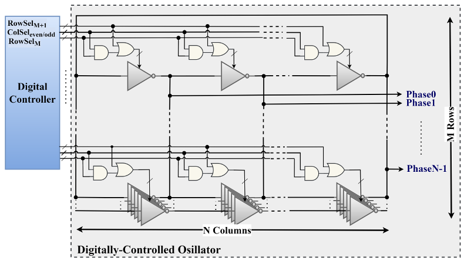
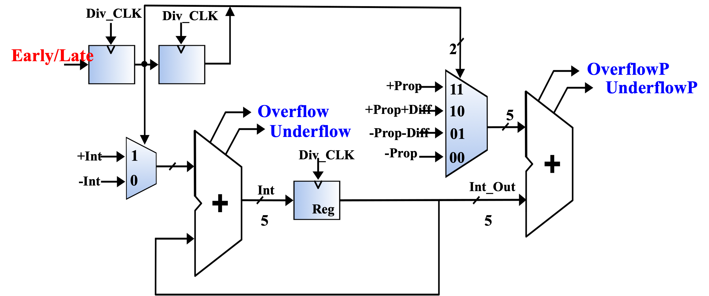

# ADPLL
A frequency detector (PFD) is used to compare the arrival times of the reference and divided clock edges. The resulting early/late information is filtered through a DLF at a divided frequency.
The output of the filter is divided into the most significant bits (MSB), which are directly sent to the DCO for coarse tuning and the least significant bits (LSB), which are sent to the sigma delta modulator for fine tuning.
The output of the DCO is used to generate a local clock that goes to all of the digital logic and to generate a clock gating signal that further reduces the clock frequency and is used by DLF and PFD.

The proposed ADPLL is designed in 22-nm and its layout occupies an area of (71×32 μm2).

### ADPLL Topology

# DCO Array
This picture shows the structure of the DCO. It is implemented with an array of tri-state inverters.
The inverters that comprise the ring are divided into addressable component structures.

Our design has 17 rows by 3 columns, and each stage has 15-ring oscillators, which results in a total of 765 inverters. 
The first 16 rows of the inverter array are turned on/off by a row/column pseudo-thermometer control (PTC) 

As more inverters in each stage are turned on by the control blocks of the DCO, the current driving strength of the stage increases while its capacitive load remains essentially constant, So, this results in an increase in the output frequency.

# PFD
This picture shows the self-timed, phase and frequency detector.
The two input latches are used to detect the arrival of an edge on the reference and feedback clocks.
A mutual exclusion element, or MUTEX, in the middle determines which of the two edges arrives first and stores the result in a set-reset flip-flop.
A self-timed reset loop determines that all events have taken place and generates a reset pulse that prepares the PFD for future edges of the reference and feedback clocks

# Digital loop Filter
The PID loop filter operates at the divided DCO frequency. 
All operations are performed using five bits of resolution.
Underflows and overflows are passed to the DCO control for further accumulation and then, the DCO control increases or decreases the output frequency of the oscillator.
We have 2 dithering inverters. OverflowP and underflowP can turn on or off the dithering inverters. 

# DCO_Control_Unit
This is the core of our design which takes control of everything.
To efficiently regulate the DCO, a matrix architecture is employed. 
This architecture receives LSB and MSB bits from LP for frequency tuning.

# ADPLL Layout

